# 新規RPGタイトル開発プロジェクト スケジュール

ワークフロー別・チーム別の2種類のガントチャートを掲載している。
各チャート内はJobごとにセクション分けしたうえで、重ならないタスクは
同じ行にまとめて表示している。
◆マークはマイルストーン（プロジェクト開始日・各締切日）を示す。
すべてのチャートに同じマイルストーンを含めているため、表示期間は
チャート間で揃っている（比較しやすいように統一）。

# ワークフロー別

## 背景美術制作

```mermaid
---
displayMode: compact
---
gantt
    dateFormat YYYY-MM-DD
    tickInterval 1week
    weekday monday

    section マイルストーン
    プロジェクト開始 :milestone, WF_MS_PROJECT_START, 2026-09-01, 0d
    展示会向けプロトタイプ :milestone, WF_MS_MS_PROTO, 2026-12-18, 0d
    アルファ版（コアアセット確定） :milestone, WF_MS_MS_ALPHA, 2027-06-04, 0d
    ベータ版（全カットシーン組み込み） :milestone, WF_MS_MS_BETA, 2028-02-04, 0d
    マスターアップ :milestone, WF_MS_MS_MASTER, 2028-08-29, 0d

    section 始まりの町
    コンセプト :WF_JOB_BG_TOWN_BG_CONCEPT, 2026-09-17, 2026-09-30
    ラフモデル :WF_JOB_BG_TOWN_BG_ROUGH, 2026-09-30, 2026-10-10
    本モデル :WF_JOB_BG_TOWN_BG_MODEL, 2026-10-13, 2026-11-05
    ライティング :WF_JOB_BG_TOWN_BG_LIGHT, 2026-11-05, 2026-11-13
    最適化（LOD） :WF_JOB_BG_TOWN_BG_OPT, 2026-11-13, 2026-11-20
    デバッグ・QA :WF_JOB_BG_TOWN_BG_QA, 2026-11-20, 2026-11-27

    section 港町
    コンセプト :WF_JOB_BG_PORT_BG_CONCEPT, 2026-12-24, 2027-01-08
    ラフモデル :WF_JOB_BG_PORT_BG_ROUGH, 2027-01-08, 2027-01-21
    本モデル :WF_JOB_BG_PORT_BG_MODEL, 2027-01-21, 2027-02-13
    ライティング :WF_JOB_BG_PORT_BG_LIGHT, 2027-02-15, 2027-02-23
    最適化（LOD） :WF_JOB_BG_PORT_BG_OPT, 2027-02-24, 2027-03-03
    デバッグ・QA :WF_JOB_BG_PORT_BG_QA, 2027-03-03, 2027-03-09

    section 中央都市
    コンセプト :WF_JOB_BG_CAPITAL_BG_CONCEPT, 2027-02-05, 2027-02-16
    ラフモデル :WF_JOB_BG_CAPITAL_BG_ROUGH, 2027-02-16, 2027-02-27
    本モデル :WF_JOB_BG_CAPITAL_BG_MODEL, 2027-03-01, 2027-03-24
    ライティング :WF_JOB_BG_CAPITAL_BG_LIGHT, 2027-03-25, 2027-04-02
    最適化（LOD） :WF_JOB_BG_CAPITAL_BG_OPT, 2027-04-02, 2027-04-09
    デバッグ・QA :WF_JOB_BG_CAPITAL_BG_QA, 2027-04-12, 2027-04-16

    section 序盤ダンジョン
    コンセプト :WF_JOB_BG_DUNGEON_BG_CONCEPT, 2027-02-24, 2027-03-04
    ラフモデル :WF_JOB_BG_DUNGEON_BG_ROUGH, 2027-03-04, 2027-03-16
    本モデル :WF_JOB_BG_DUNGEON_BG_MODEL, 2027-03-19, 2027-04-13
    ライティング :WF_JOB_BG_DUNGEON_BG_LIGHT, 2027-04-13, 2027-04-21
    最適化（LOD） :WF_JOB_BG_DUNGEON_BG_OPT, 2027-04-21, 2027-04-28
    デバッグ・QA :WF_JOB_BG_DUNGEON_BG_QA, 2027-04-30, 2027-05-11

    section 森林エリア
    コンセプト :WF_JOB_BG_FOREST_BG_CONCEPT, 2027-03-02, 2027-03-10
    ラフモデル :WF_JOB_BG_FOREST_BG_ROUGH, 2027-03-10, 2027-03-20
    本モデル :WF_JOB_BG_FOREST_BG_MODEL, 2027-03-25, 2027-04-16
    ライティング :WF_JOB_BG_FOREST_BG_LIGHT, 2027-04-19, 2027-04-27
    最適化（LOD） :WF_JOB_BG_FOREST_BG_OPT, 2027-04-27, 2027-05-08
    デバッグ・QA :WF_JOB_BG_FOREST_BG_QA, 2027-05-10, 2027-05-14

    section 魔王城内部
    コンセプト :WF_JOB_BG_DEMONCASTLE_IN_BG_CONCEPT, 2027-04-21, 2027-04-29
    ラフモデル :WF_JOB_BG_DEMONCASTLE_IN_BG_ROUGH, 2027-04-30, 2027-05-15
    本モデル :WF_JOB_BG_DEMONCASTLE_IN_BG_MODEL, 2027-05-17, 2027-06-08
    ライティング :WF_JOB_BG_DEMONCASTLE_IN_BG_LIGHT, 2027-06-08, 2027-06-16
    最適化（LOD） :WF_JOB_BG_DEMONCASTLE_IN_BG_OPT, 2027-06-16, 2027-06-23
    デバッグ・QA :WF_JOB_BG_DEMONCASTLE_IN_BG_QA, 2027-06-24, 2027-06-30

    section 地下水路
    コンセプト :WF_JOB_BG_SEWER_BG_CONCEPT, 2027-04-28, 2027-05-12
    ラフモデル :WF_JOB_BG_SEWER_BG_ROUGH, 2027-05-12, 2027-05-22
    本モデル :WF_JOB_BG_SEWER_BG_MODEL, 2027-05-24, 2027-06-15
    ライティング :WF_JOB_BG_SEWER_BG_LIGHT, 2027-06-15, 2027-06-23
    最適化（LOD） :WF_JOB_BG_SEWER_BG_OPT, 2027-06-23, 2027-06-30
    デバッグ・QA :WF_JOB_BG_SEWER_BG_QA, 2027-07-01, 2027-07-07

    section 雪山エリア
    コンセプト :WF_JOB_BG_SNOW_BG_CONCEPT, 2027-05-21, 2027-05-29
    ラフモデル :WF_JOB_BG_SNOW_BG_ROUGH, 2027-05-31, 2027-06-10
    本モデル :WF_JOB_BG_SNOW_BG_MODEL, 2027-06-14, 2027-07-06
    ライティング :WF_JOB_BG_SNOW_BG_LIGHT, 2027-07-08, 2027-07-16
    最適化（LOD） :WF_JOB_BG_SNOW_BG_OPT, 2027-07-16, 2027-07-24
    デバッグ・QA :WF_JOB_BG_SNOW_BG_QA, 2027-07-26, 2027-07-30

    section 沼地ダンジョン
    コンセプト :WF_JOB_BG_SWAMP_BG_CONCEPT, 2027-05-31, 2027-06-08
    ラフモデル :WF_JOB_BG_SWAMP_BG_ROUGH, 2027-06-08, 2027-06-18
    本モデル :WF_JOB_BG_SWAMP_BG_MODEL, 2027-06-22, 2027-07-14
    ライティング :WF_JOB_BG_SWAMP_BG_LIGHT, 2027-07-20, 2027-07-28
    最適化（LOD） :WF_JOB_BG_SWAMP_BG_OPT, 2027-07-28, 2027-08-04
    デバッグ・QA :WF_JOB_BG_SWAMP_BG_QA, 2027-08-04, 2027-08-10

    section 氷結洞窟
    コンセプト :WF_JOB_BG_ICECAVE_BG_CONCEPT, 2027-07-05, 2027-07-13
    ラフモデル :WF_JOB_BG_ICECAVE_BG_ROUGH, 2027-07-13, 2027-07-24
    本モデル :WF_JOB_BG_ICECAVE_BG_MODEL, 2027-07-28, 2027-08-24
    ライティング :WF_JOB_BG_ICECAVE_BG_LIGHT, 2027-08-24, 2027-09-01
    最適化（LOD） :WF_JOB_BG_ICECAVE_BG_OPT, 2027-09-02, 2027-09-09
    デバッグ・QA :WF_JOB_BG_ICECAVE_BG_QA, 2027-09-09, 2027-09-15

    section ラストダンジョン
    コンセプト :WF_JOB_BG_LASTDUNGEON_BG_CONCEPT, 2027-07-26, 2027-08-03
    ラフモデル :WF_JOB_BG_LASTDUNGEON_BG_ROUGH, 2027-08-03, 2027-08-18
    本モデル :WF_JOB_BG_LASTDUNGEON_BG_MODEL, 2027-08-18, 2027-09-22
    ライティング :WF_JOB_BG_LASTDUNGEON_BG_LIGHT, 2027-09-22, 2027-10-01
    最適化（LOD） :WF_JOB_BG_LASTDUNGEON_BG_OPT, 2027-10-04, 2027-10-09
    デバッグ・QA :WF_JOB_BG_LASTDUNGEON_BG_QA, 2027-10-12, 2027-10-16

    section 天空遺跡
    コンセプト :WF_JOB_BG_RUINS_BG_CONCEPT, 2027-09-10, 2027-09-18
    ラフモデル :WF_JOB_BG_RUINS_BG_ROUGH, 2027-09-21, 2027-10-02
    本モデル :WF_JOB_BG_RUINS_BG_MODEL, 2027-10-04, 2027-10-27
    ライティング :WF_JOB_BG_RUINS_BG_LIGHT, 2027-10-28, 2027-11-06
    最適化（LOD） :WF_JOB_BG_RUINS_BG_OPT, 2027-11-08, 2027-11-13
    デバッグ・QA :WF_JOB_BG_RUINS_BG_QA, 2027-11-15, 2027-11-19

    section 火山ダンジョン
    コンセプト :WF_JOB_BG_VOLCANO_BG_CONCEPT, 2027-10-05, 2027-10-14
    ラフモデル :WF_JOB_BG_VOLCANO_BG_ROUGH, 2027-10-14, 2027-10-26
    本モデル :WF_JOB_BG_VOLCANO_BG_MODEL, 2027-10-28, 2027-11-20
    ライティング :WF_JOB_BG_VOLCANO_BG_LIGHT, 2027-11-22, 2027-12-01
    最適化（LOD） :WF_JOB_BG_VOLCANO_BG_OPT, 2027-12-01, 2027-12-08
    デバッグ・QA :WF_JOB_BG_VOLCANO_BG_QA, 2027-12-08, 2027-12-14

    section 終盤の城
    コンセプト :WF_JOB_BG_CASTLE_BG_CONCEPT, 2027-10-06, 2027-10-15
    ラフモデル :WF_JOB_BG_CASTLE_BG_ROUGH, 2027-10-15, 2027-10-27
    本モデル :WF_JOB_BG_CASTLE_BG_MODEL, 2027-10-29, 2027-11-23
    ライティング :WF_JOB_BG_CASTLE_BG_LIGHT, 2027-11-24, 2027-12-02
    最適化（LOD） :WF_JOB_BG_CASTLE_BG_OPT, 2027-12-02, 2027-12-09
    デバッグ・QA :WF_JOB_BG_CASTLE_BG_QA, 2027-12-09, 2027-12-15

    section 砂漠エリア
    コンセプト :WF_JOB_BG_DESERT_BG_CONCEPT, 2027-10-18, 2027-10-26
    ラフモデル :WF_JOB_BG_DESERT_BG_ROUGH, 2027-10-26, 2027-11-06
    本モデル :WF_JOB_BG_DESERT_BG_MODEL, 2027-11-08, 2027-12-01
    ライティング :WF_JOB_BG_DESERT_BG_LIGHT, 2027-12-03, 2027-12-11
    最適化（LOD） :WF_JOB_BG_DESERT_BG_OPT, 2027-12-13, 2027-12-18
    デバッグ・QA :WF_JOB_BG_DESERT_BG_QA, 2027-12-20, 2027-12-24

```

## キャラクター制作

```mermaid
---
displayMode: compact
---
gantt
    dateFormat YYYY-MM-DD
    tickInterval 1week
    weekday monday

    section マイルストーン
    プロジェクト開始 :milestone, WF_MS_PROJECT_START, 2026-09-01, 0d
    展示会向けプロトタイプ :milestone, WF_MS_MS_PROTO, 2026-12-18, 0d
    アルファ版（コアアセット確定） :milestone, WF_MS_MS_ALPHA, 2027-06-04, 0d
    ベータ版（全カットシーン組み込み） :milestone, WF_MS_MS_BETA, 2028-02-04, 0d
    マスターアップ :milestone, WF_MS_MS_MASTER, 2028-08-29, 0d

    section ヒロイン
    デザイン :WF_JOB_CHAR_HEROINE_CH_DESIGN, 2026-09-24, 2026-10-06
    ラフモデル :WF_JOB_CHAR_HEROINE_CH_ROUGH, 2026-10-06, 2026-10-15
    本モデル :WF_JOB_CHAR_HEROINE_CH_MODEL, 2026-10-15, 2026-11-05
    リグ :WF_JOB_CHAR_HEROINE_CH_RIG, 2026-10-15, 2026-10-27
    フェイスリグ :WF_JOB_CHAR_HEROINE_CH_FACERIG, 2026-10-27, 2026-11-03
    アニメーション :WF_JOB_CHAR_HEROINE_CH_ANIM, 2026-11-05, 2026-12-01
    エフェクト :WF_JOB_CHAR_HEROINE_CH_FX, 2026-11-05, 2026-11-13
    エンジン実装 :WF_JOB_CHAR_HEROINE_CH_IMPL, 2026-12-01, 2026-12-04
    デバッグ・QA :WF_JOB_CHAR_HEROINE_CH_QA, 2026-12-04, 2026-12-11

    section 主人公
    デザイン :WF_JOB_CHAR_HERO_CH_DESIGN, 2026-09-29, 2026-10-09
    ラフモデル :WF_JOB_CHAR_HERO_CH_ROUGH, 2026-10-09, 2026-10-20
    本モデル :WF_JOB_CHAR_HERO_CH_MODEL, 2026-10-22, 2026-11-18
    リグ :WF_JOB_CHAR_HERO_CH_RIG, 2026-10-22, 2026-11-03
    フェイスリグ :WF_JOB_CHAR_HERO_CH_FACERIG, 2026-11-04, 2026-11-11
    アニメーション :WF_JOB_CHAR_HERO_CH_ANIM, 2026-11-18, 2026-12-11
    エフェクト :WF_JOB_CHAR_HERO_CH_FX, 2026-11-18, 2026-11-27
    エンジン実装 :WF_JOB_CHAR_HERO_CH_IMPL, 2026-12-11, 2026-12-16
    デバッグ・QA :WF_JOB_CHAR_HERO_CH_QA, 2026-12-16, 2026-12-23

    section ライバルキャラ
    デザイン :WF_JOB_CHAR_RIVAL_CH_DESIGN, 2026-12-02, 2026-12-12
    ラフモデル :WF_JOB_CHAR_RIVAL_CH_ROUGH, 2026-12-14, 2026-12-22
    本モデル :WF_JOB_CHAR_RIVAL_CH_MODEL, 2026-12-25, 2027-01-22
    リグ :WF_JOB_CHAR_RIVAL_CH_RIG, 2026-12-25, 2027-01-14
    フェイスリグ :WF_JOB_CHAR_RIVAL_CH_FACERIG, 2027-01-14, 2027-01-21
    アニメーション :WF_JOB_CHAR_RIVAL_CH_ANIM, 2027-01-22, 2027-02-16
    エフェクト :WF_JOB_CHAR_RIVAL_CH_FX, 2027-01-22, 2027-01-30
    エンジン実装 :WF_JOB_CHAR_RIVAL_CH_IMPL, 2027-02-16, 2027-02-19
    デバッグ・QA :WF_JOB_CHAR_RIVAL_CH_QA, 2027-02-19, 2027-02-27

    section 師匠キャラ
    デザイン :WF_JOB_CHAR_MENTOR_CH_DESIGN, 2026-12-03, 2026-12-15
    ラフモデル :WF_JOB_CHAR_MENTOR_CH_ROUGH, 2026-12-15, 2026-12-23
    本モデル :WF_JOB_CHAR_MENTOR_CH_MODEL, 2026-12-28, 2027-01-23
    リグ :WF_JOB_CHAR_MENTOR_CH_RIG, 2026-12-28, 2027-01-15
    フェイスリグ :WF_JOB_CHAR_MENTOR_CH_FACERIG, 2027-01-15, 2027-01-22
    アニメーション :WF_JOB_CHAR_MENTOR_CH_ANIM, 2027-01-25, 2027-02-17
    エフェクト :WF_JOB_CHAR_MENTOR_CH_FX, 2027-01-25, 2027-02-02
    エンジン実装 :WF_JOB_CHAR_MENTOR_CH_IMPL, 2027-02-17, 2027-02-20
    デバッグ・QA :WF_JOB_CHAR_MENTOR_CH_QA, 2027-02-22, 2027-03-02

    section 相棒モンスター
    デザイン :WF_JOB_CHAR_PARTNER_CH_DESIGN, 2026-12-21, 2027-01-07
    ラフモデル :WF_JOB_CHAR_PARTNER_CH_ROUGH, 2027-01-07, 2027-01-16
    本モデル :WF_JOB_CHAR_PARTNER_CH_MODEL, 2027-01-18, 2027-02-05
    リグ :WF_JOB_CHAR_PARTNER_CH_RIG, 2027-01-18, 2027-01-28
    フェイスリグ :WF_JOB_CHAR_PARTNER_CH_FACERIG, 2027-01-28, 2027-02-04
    アニメーション :WF_JOB_CHAR_PARTNER_CH_ANIM, 2027-02-05, 2027-03-03
    エフェクト :WF_JOB_CHAR_PARTNER_CH_FX, 2027-02-05, 2027-02-16
    エンジン実装 :WF_JOB_CHAR_PARTNER_CH_IMPL, 2027-03-03, 2027-03-06
    デバッグ・QA :WF_JOB_CHAR_PARTNER_CH_QA, 2027-03-08, 2027-03-13

    section 老賢者
    デザイン :WF_JOB_CHAR_SAGE_CH_DESIGN, 2027-01-06, 2027-01-19
    ラフモデル :WF_JOB_CHAR_SAGE_CH_ROUGH, 2027-01-19, 2027-01-27
    本モデル :WF_JOB_CHAR_SAGE_CH_MODEL, 2027-01-29, 2027-02-19
    リグ :WF_JOB_CHAR_SAGE_CH_RIG, 2027-01-29, 2027-02-10
    フェイスリグ :WF_JOB_CHAR_SAGE_CH_FACERIG, 2027-02-10, 2027-02-18
    アニメーション :WF_JOB_CHAR_SAGE_CH_ANIM, 2027-02-19, 2027-03-16
    エフェクト :WF_JOB_CHAR_SAGE_CH_FX, 2027-02-19, 2027-03-02
    エンジン実装 :WF_JOB_CHAR_SAGE_CH_IMPL, 2027-03-16, 2027-03-19
    デバッグ・QA :WF_JOB_CHAR_SAGE_CH_QA, 2027-03-19, 2027-03-27

    section 商人ギルド長
    デザイン :WF_JOB_CHAR_MERCHANT_CH_DESIGN, 2027-01-25, 2027-02-04
    ラフモデル :WF_JOB_CHAR_MERCHANT_CH_ROUGH, 2027-02-04, 2027-02-13
    本モデル :WF_JOB_CHAR_MERCHANT_CH_MODEL, 2027-02-17, 2027-03-10
    リグ :WF_JOB_CHAR_MERCHANT_CH_RIG, 2027-02-17, 2027-03-02
    フェイスリグ :WF_JOB_CHAR_MERCHANT_CH_FACERIG, 2027-03-02, 2027-03-09
    アニメーション :WF_JOB_CHAR_MERCHANT_CH_ANIM, 2027-03-10, 2027-04-02
    エフェクト :WF_JOB_CHAR_MERCHANT_CH_FX, 2027-03-10, 2027-03-18
    エンジン実装 :WF_JOB_CHAR_MERCHANT_CH_IMPL, 2027-04-05, 2027-04-08
    デバッグ・QA :WF_JOB_CHAR_MERCHANT_CH_QA, 2027-04-08, 2027-04-15

    section 町長
    デザイン :WF_JOB_CHAR_MAYOR_CH_DESIGN, 2027-02-01, 2027-02-11
    ラフモデル :WF_JOB_CHAR_MAYOR_CH_ROUGH, 2027-02-12, 2027-02-20
    本モデル :WF_JOB_CHAR_MAYOR_CH_MODEL, 2027-02-24, 2027-03-16
    リグ :WF_JOB_CHAR_MAYOR_CH_RIG, 2027-02-24, 2027-03-06
    フェイスリグ :WF_JOB_CHAR_MAYOR_CH_FACERIG, 2027-03-08, 2027-03-13
    アニメーション :WF_JOB_CHAR_MAYOR_CH_ANIM, 2027-03-16, 2027-04-08
    エフェクト :WF_JOB_CHAR_MAYOR_CH_FX, 2027-03-16, 2027-03-25
    エンジン実装 :WF_JOB_CHAR_MAYOR_CH_IMPL, 2027-04-12, 2027-04-15
    デバッグ・QA :WF_JOB_CHAR_MAYOR_CH_QA, 2027-04-15, 2027-04-22

    section 教会の司祭
    デザイン :WF_JOB_CHAR_PRIEST_CH_DESIGN, 2027-02-02, 2027-02-13
    ラフモデル :WF_JOB_CHAR_PRIEST_CH_ROUGH, 2027-02-15, 2027-02-23
    本モデル :WF_JOB_CHAR_PRIEST_CH_MODEL, 2027-02-25, 2027-03-17
    リグ :WF_JOB_CHAR_PRIEST_CH_RIG, 2027-02-25, 2027-03-09
    フェイスリグ :WF_JOB_CHAR_PRIEST_CH_FACERIG, 2027-03-09, 2027-03-16
    アニメーション :WF_JOB_CHAR_PRIEST_CH_ANIM, 2027-03-18, 2027-04-10
    エフェクト :WF_JOB_CHAR_PRIEST_CH_FX, 2027-03-18, 2027-03-27
    エンジン実装 :WF_JOB_CHAR_PRIEST_CH_IMPL, 2027-04-12, 2027-04-15
    デバッグ・QA :WF_JOB_CHAR_PRIEST_CH_QA, 2027-04-15, 2027-04-22

    section ザコ敵（機械兵）
    ラフモデル :WF_JOB_CHAR_ENEMY_MACHINE_CH_ROUGH, 2027-04-13, 2027-04-21
    本モデル :WF_JOB_CHAR_ENEMY_MACHINE_CH_MODEL, 2027-04-21, 2027-05-15
    リグ :WF_JOB_CHAR_ENEMY_MACHINE_CH_RIG, 2027-04-21, 2027-05-07
    アニメーション :WF_JOB_CHAR_ENEMY_MACHINE_CH_ANIM, 2027-05-17, 2027-06-08
    エフェクト :WF_JOB_CHAR_ENEMY_MACHINE_CH_FX, 2027-05-17, 2027-05-25
    エンジン実装 :WF_JOB_CHAR_ENEMY_MACHINE_CH_IMPL, 2027-06-08, 2027-06-11
    デバッグ・QA :WF_JOB_CHAR_ENEMY_MACHINE_CH_QA, 2027-06-11, 2027-06-18

    section 魔王
    デザイン :WF_JOB_CHAR_DEMONLORD_CH_DESIGN, 2027-04-15, 2027-04-27
    ラフモデル :WF_JOB_CHAR_DEMONLORD_CH_ROUGH, 2027-04-27, 2027-05-11
    本モデル :WF_JOB_CHAR_DEMONLORD_CH_MODEL, 2027-05-11, 2027-05-29
    リグ :WF_JOB_CHAR_DEMONLORD_CH_RIG, 2027-05-11, 2027-05-21
    フェイスリグ :WF_JOB_CHAR_DEMONLORD_CH_FACERIG, 2027-05-21, 2027-05-28
    アニメーション :WF_JOB_CHAR_DEMONLORD_CH_ANIM, 2027-05-31, 2027-06-22
    エフェクト :WF_JOB_CHAR_DEMONLORD_CH_FX, 2027-05-31, 2027-06-08
    エンジン実装 :WF_JOB_CHAR_DEMONLORD_CH_IMPL, 2027-06-23, 2027-06-26
    デバッグ・QA :WF_JOB_CHAR_DEMONLORD_CH_QA, 2027-06-28, 2027-07-03

    section 王女
    デザイン :WF_JOB_CHAR_PRINCESS_CH_DESIGN, 2027-05-18, 2027-05-28
    ラフモデル :WF_JOB_CHAR_PRINCESS_CH_ROUGH, 2027-05-28, 2027-06-05
    本モデル :WF_JOB_CHAR_PRINCESS_CH_MODEL, 2027-06-10, 2027-06-30
    リグ :WF_JOB_CHAR_PRINCESS_CH_RIG, 2027-06-10, 2027-06-22
    フェイスリグ :WF_JOB_CHAR_PRINCESS_CH_FACERIG, 2027-06-22, 2027-06-29
    アニメーション :WF_JOB_CHAR_PRINCESS_CH_ANIM, 2027-07-01, 2027-07-24
    エフェクト :WF_JOB_CHAR_PRINCESS_CH_FX, 2027-07-01, 2027-07-09
    エンジン実装 :WF_JOB_CHAR_PRINCESS_CH_IMPL, 2027-07-26, 2027-07-29
    デバッグ・QA :WF_JOB_CHAR_PRINCESS_CH_QA, 2027-07-29, 2027-08-05

    section 四天王・氷
    デザイン :WF_JOB_CHAR_FOUR_ICE_CH_DESIGN, 2027-06-21, 2027-07-01
    ラフモデル :WF_JOB_CHAR_FOUR_ICE_CH_ROUGH, 2027-07-01, 2027-07-09
    本モデル :WF_JOB_CHAR_FOUR_ICE_CH_MODEL, 2027-07-14, 2027-08-04
    リグ :WF_JOB_CHAR_FOUR_ICE_CH_RIG, 2027-07-14, 2027-07-27
    フェイスリグ :WF_JOB_CHAR_FOUR_ICE_CH_FACERIG, 2027-07-27, 2027-08-03
    アニメーション :WF_JOB_CHAR_FOUR_ICE_CH_ANIM, 2027-08-04, 2027-08-31
    エフェクト :WF_JOB_CHAR_FOUR_ICE_CH_FX, 2027-08-04, 2027-08-13
    エンジン実装 :WF_JOB_CHAR_FOUR_ICE_CH_IMPL, 2027-08-31, 2027-09-04
    デバッグ・QA :WF_JOB_CHAR_FOUR_ICE_CH_QA, 2027-09-06, 2027-09-11

    section 四天王・雷
    デザイン :WF_JOB_CHAR_FOUR_THUNDER_CH_DESIGN, 2027-07-20, 2027-07-30
    ラフモデル :WF_JOB_CHAR_FOUR_THUNDER_CH_ROUGH, 2027-07-30, 2027-08-07
    本モデル :WF_JOB_CHAR_FOUR_THUNDER_CH_MODEL, 2027-08-10, 2027-09-02
    リグ :WF_JOB_CHAR_FOUR_THUNDER_CH_RIG, 2027-08-10, 2027-08-25
    フェイスリグ :WF_JOB_CHAR_FOUR_THUNDER_CH_FACERIG, 2027-08-25, 2027-09-01
    アニメーション :WF_JOB_CHAR_FOUR_THUNDER_CH_ANIM, 2027-09-02, 2027-09-28
    エフェクト :WF_JOB_CHAR_FOUR_THUNDER_CH_FX, 2027-09-02, 2027-09-10
    エンジン実装 :WF_JOB_CHAR_FOUR_THUNDER_CH_IMPL, 2027-09-28, 2027-10-01
    デバッグ・QA :WF_JOB_CHAR_FOUR_THUNDER_CH_QA, 2027-10-01, 2027-10-08

    section モブNPC（衛兵）
    ラフモデル :WF_JOB_CHAR_NPC_GUARD_CH_ROUGH, 2027-07-28, 2027-08-05
    本モデル :WF_JOB_CHAR_NPC_GUARD_CH_MODEL, 2027-08-05, 2027-08-28
    リグ :WF_JOB_CHAR_NPC_GUARD_CH_RIG, 2027-08-05, 2027-08-20
    アニメーション :WF_JOB_CHAR_NPC_GUARD_CH_ANIM, 2027-08-30, 2027-09-22
    エフェクト :WF_JOB_CHAR_NPC_GUARD_CH_FX, 2027-08-30, 2027-09-07
    エンジン実装 :WF_JOB_CHAR_NPC_GUARD_CH_IMPL, 2027-09-22, 2027-09-28
    デバッグ・QA :WF_JOB_CHAR_NPC_GUARD_CH_QA, 2027-09-28, 2027-10-05

    section 四天王・炎
    デザイン :WF_JOB_CHAR_FOUR_FIRE_CH_DESIGN, 2027-08-02, 2027-08-13
    ラフモデル :WF_JOB_CHAR_FOUR_FIRE_CH_ROUGH, 2027-08-17, 2027-08-25
    本モデル :WF_JOB_CHAR_FOUR_FIRE_CH_MODEL, 2027-08-25, 2027-09-14
    リグ :WF_JOB_CHAR_FOUR_FIRE_CH_RIG, 2027-08-25, 2027-09-07
    フェイスリグ :WF_JOB_CHAR_FOUR_FIRE_CH_FACERIG, 2027-09-07, 2027-09-14
    アニメーション :WF_JOB_CHAR_FOUR_FIRE_CH_ANIM, 2027-09-14, 2027-10-08
    エフェクト :WF_JOB_CHAR_FOUR_FIRE_CH_FX, 2027-09-14, 2027-09-23
    エンジン実装 :WF_JOB_CHAR_FOUR_FIRE_CH_IMPL, 2027-10-08, 2027-10-14
    デバッグ・QA :WF_JOB_CHAR_FOUR_FIRE_CH_QA, 2027-10-14, 2027-10-21

    section ザコ敵（アンデッド族）
    ラフモデル :WF_JOB_CHAR_ENEMY_UNDEAD_CH_ROUGH, 2027-08-17, 2027-08-25
    本モデル :WF_JOB_CHAR_ENEMY_UNDEAD_CH_MODEL, 2027-08-25, 2027-09-14
    リグ :WF_JOB_CHAR_ENEMY_UNDEAD_CH_RIG, 2027-08-25, 2027-09-07
    アニメーション :WF_JOB_CHAR_ENEMY_UNDEAD_CH_ANIM, 2027-09-14, 2027-10-08
    エフェクト :WF_JOB_CHAR_ENEMY_UNDEAD_CH_FX, 2027-09-14, 2027-09-23
    エンジン実装 :WF_JOB_CHAR_ENEMY_UNDEAD_CH_IMPL, 2027-10-08, 2027-10-14
    デバッグ・QA :WF_JOB_CHAR_ENEMY_UNDEAD_CH_QA, 2027-10-14, 2027-10-21

    section 四天王・闇
    デザイン :WF_JOB_CHAR_FOUR_DARK_CH_DESIGN, 2027-10-12, 2027-10-22
    ラフモデル :WF_JOB_CHAR_FOUR_DARK_CH_ROUGH, 2027-10-22, 2027-10-30
    本モデル :WF_JOB_CHAR_FOUR_DARK_CH_MODEL, 2027-11-02, 2027-11-23
    リグ :WF_JOB_CHAR_FOUR_DARK_CH_RIG, 2027-11-02, 2027-11-13
    フェイスリグ :WF_JOB_CHAR_FOUR_DARK_CH_FACERIG, 2027-11-15, 2027-11-20
    アニメーション :WF_JOB_CHAR_FOUR_DARK_CH_ANIM, 2027-11-24, 2027-12-16
    エフェクト :WF_JOB_CHAR_FOUR_DARK_CH_FX, 2027-11-24, 2027-12-02
    エンジン実装 :WF_JOB_CHAR_FOUR_DARK_CH_IMPL, 2027-12-20, 2027-12-23
    デバッグ・QA :WF_JOB_CHAR_FOUR_DARK_CH_QA, 2027-12-23, 2028-01-06

    section モブNPC（町人）
    ラフモデル :WF_JOB_CHAR_NPC_TOWN_CH_ROUGH, 2027-10-15, 2027-10-23
    本モデル :WF_JOB_CHAR_NPC_TOWN_CH_MODEL, 2027-10-25, 2027-11-13
    リグ :WF_JOB_CHAR_NPC_TOWN_CH_RIG, 2027-10-25, 2027-11-05
    アニメーション :WF_JOB_CHAR_NPC_TOWN_CH_ANIM, 2027-11-15, 2027-12-08
    エフェクト :WF_JOB_CHAR_NPC_TOWN_CH_FX, 2027-11-15, 2027-11-23
    エンジン実装 :WF_JOB_CHAR_NPC_TOWN_CH_IMPL, 2027-12-10, 2027-12-15
    デバッグ・QA :WF_JOB_CHAR_NPC_TOWN_CH_QA, 2027-12-15, 2027-12-22

    section ザコ敵（ゴブリン族）
    ラフモデル :WF_JOB_CHAR_ENEMY_GOBLIN_CH_ROUGH, 2027-10-18, 2027-10-26
    本モデル :WF_JOB_CHAR_ENEMY_GOBLIN_CH_MODEL, 2027-10-26, 2027-11-16
    リグ :WF_JOB_CHAR_ENEMY_GOBLIN_CH_RIG, 2027-10-26, 2027-11-06
    アニメーション :WF_JOB_CHAR_ENEMY_GOBLIN_CH_ANIM, 2027-11-17, 2027-12-10
    エフェクト :WF_JOB_CHAR_ENEMY_GOBLIN_CH_FX, 2027-11-17, 2027-11-26
    エンジン実装 :WF_JOB_CHAR_ENEMY_GOBLIN_CH_IMPL, 2027-12-13, 2027-12-16
    デバッグ・QA :WF_JOB_CHAR_ENEMY_GOBLIN_CH_QA, 2027-12-16, 2027-12-23

```

## カットシーン制作

```mermaid
---
displayMode: compact
---
gantt
    dateFormat YYYY-MM-DD
    tickInterval 1week
    weekday monday

    section マイルストーン
    プロジェクト開始 :milestone, WF_MS_PROJECT_START, 2026-09-01, 0d
    展示会向けプロトタイプ :milestone, WF_MS_MS_PROTO, 2026-12-18, 0d
    アルファ版（コアアセット確定） :milestone, WF_MS_MS_ALPHA, 2027-06-04, 0d
    ベータ版（全カットシーン組み込み） :milestone, WF_MS_MS_BETA, 2028-02-04, 0d
    マスターアップ :milestone, WF_MS_MS_MASTER, 2028-08-29, 0d

    section オープニングムービー
    台本 :WF_JOB_CS_OPENING_CS_SCRIPT, 2026-09-24, 2026-10-01
    絵コンテ :WF_JOB_CS_OPENING_CS_STORYBOARD, 2026-10-01, 2026-10-09
    モーションキャプチャ :WF_JOB_CS_OPENING_CS_MOCAP, 2026-10-09, 2026-10-15
    プリビズ :WF_JOB_CS_OPENING_CS_PREVIZ, 2026-10-20, 2026-10-30
    アニメーション :WF_JOB_CS_OPENING_CS_ANIM, 2026-10-30, 2026-11-21
    フェイシャルアニメーション :WF_JOB_CS_OPENING_CS_FACIAL, 2026-11-24, 2026-12-02
    エンジン実装 :WF_JOB_CS_OPENING_CS_IMPL, 2026-12-02, 2026-12-05
    デバッグ・QA :WF_JOB_CS_OPENING_CS_QA, 2026-12-07, 2026-12-12

    section 主人公覚醒イベント
    台本 :WF_JOB_CS_HERO_AWAKEN_CS_SCRIPT, 2026-12-10, 2026-12-17
    絵コンテ :WF_JOB_CS_HERO_AWAKEN_CS_STORYBOARD, 2026-12-17, 2026-12-25
    モーションキャプチャ :WF_JOB_CS_HERO_AWAKEN_CS_MOCAP, 2026-12-25, 2027-01-06
    プリビズ :WF_JOB_CS_HERO_AWAKEN_CS_PREVIZ, 2027-03-16, 2027-03-27
    アニメーション :WF_JOB_CS_HERO_AWAKEN_CS_ANIM, 2027-03-29, 2027-04-16
    フェイシャルアニメーション :WF_JOB_CS_HERO_AWAKEN_CS_FACIAL, 2027-04-16, 2027-04-24
    エンジン実装 :WF_JOB_CS_HERO_AWAKEN_CS_IMPL, 2027-04-26, 2027-04-29
    デバッグ・QA :WF_JOB_CS_HERO_AWAKEN_CS_QA, 2027-04-30, 2027-05-12

    section ヒロイン加入イベント
    台本 :WF_JOB_CS_HEROINE_JOIN_CS_SCRIPT, 2026-12-21, 2026-12-26
    絵コンテ :WF_JOB_CS_HEROINE_JOIN_CS_STORYBOARD, 2026-12-28, 2027-01-13
    モーションキャプチャ :WF_JOB_CS_HEROINE_JOIN_CS_MOCAP, 2027-01-13, 2027-01-16
    プリビズ :WF_JOB_CS_HEROINE_JOIN_CS_PREVIZ, 2027-03-23, 2027-04-02
    アニメーション :WF_JOB_CS_HEROINE_JOIN_CS_ANIM, 2027-04-02, 2027-04-22
    フェイシャルアニメーション :WF_JOB_CS_HEROINE_JOIN_CS_FACIAL, 2027-04-22, 2027-05-01
    エンジン実装 :WF_JOB_CS_HEROINE_JOIN_CS_IMPL, 2027-05-06, 2027-05-11
    デバッグ・QA :WF_JOB_CS_HEROINE_JOIN_CS_QA, 2027-05-11, 2027-05-18

    section ライバル初遭遇
    台本 :WF_JOB_CS_RIVAL_ENCOUNTER_CS_SCRIPT, 2027-02-22, 2027-03-02
    絵コンテ :WF_JOB_CS_RIVAL_ENCOUNTER_CS_STORYBOARD, 2027-03-02, 2027-03-10
    モーションキャプチャ :WF_JOB_CS_RIVAL_ENCOUNTER_CS_MOCAP, 2027-03-10, 2027-03-13
    プリビズ :WF_JOB_CS_RIVAL_ENCOUNTER_CS_PREVIZ, 2027-03-15, 2027-03-26
    アニメーション :WF_JOB_CS_RIVAL_ENCOUNTER_CS_ANIM, 2027-03-29, 2027-04-16
    フェイシャルアニメーション :WF_JOB_CS_RIVAL_ENCOUNTER_CS_FACIAL, 2027-04-19, 2027-04-27
    エンジン実装 :WF_JOB_CS_RIVAL_ENCOUNTER_CS_IMPL, 2027-04-27, 2027-05-01
    デバッグ・QA :WF_JOB_CS_RIVAL_ENCOUNTER_CS_QA, 2027-05-06, 2027-05-13

    section 四天王・氷撃破シーン
    台本 :WF_JOB_CS_FOUR_ICE_DEFEAT_CS_SCRIPT, 2027-06-15, 2027-06-22
    絵コンテ :WF_JOB_CS_FOUR_ICE_DEFEAT_CS_STORYBOARD, 2027-06-22, 2027-06-30
    モーションキャプチャ :WF_JOB_CS_FOUR_ICE_DEFEAT_CS_MOCAP, 2027-06-30, 2027-07-03
    プリビズ :WF_JOB_CS_FOUR_ICE_DEFEAT_CS_PREVIZ, 2027-07-26, 2027-08-05
    アニメーション :WF_JOB_CS_FOUR_ICE_DEFEAT_CS_ANIM, 2027-08-05, 2027-08-28
    フェイシャルアニメーション :WF_JOB_CS_FOUR_ICE_DEFEAT_CS_FACIAL, 2027-08-30, 2027-09-07
    エンジン実装 :WF_JOB_CS_FOUR_ICE_DEFEAT_CS_IMPL, 2027-09-07, 2027-09-10
    デバッグ・QA :WF_JOB_CS_FOUR_ICE_DEFEAT_CS_QA, 2027-09-10, 2027-09-17

    section ボス戦イベントシーン（魔王前哨戦）
    台本 :WF_JOB_CS_BOSS_CS_SCRIPT, 2027-06-30, 2027-07-07
    絵コンテ :WF_JOB_CS_BOSS_CS_STORYBOARD, 2027-07-07, 2027-07-15
    モーションキャプチャ :WF_JOB_CS_BOSS_CS_MOCAP, 2027-07-15, 2027-07-21
    プリビズ :WF_JOB_CS_BOSS_CS_PREVIZ, 2027-08-18, 2027-08-28
    アニメーション :WF_JOB_CS_BOSS_CS_ANIM, 2027-08-30, 2027-09-17
    フェイシャルアニメーション :WF_JOB_CS_BOSS_CS_FACIAL, 2027-09-17, 2027-09-29
    エンジン実装 :WF_JOB_CS_BOSS_CS_IMPL, 2027-09-29, 2027-10-02
    デバッグ・QA :WF_JOB_CS_BOSS_CS_QA, 2027-10-04, 2027-10-09

    section 四天王・炎撃破シーン
    台本 :WF_JOB_CS_FOUR_FIRE_DEFEAT_CS_SCRIPT, 2027-07-07, 2027-07-14
    絵コンテ :WF_JOB_CS_FOUR_FIRE_DEFEAT_CS_STORYBOARD, 2027-07-14, 2027-07-23
    モーションキャプチャ :WF_JOB_CS_FOUR_FIRE_DEFEAT_CS_MOCAP, 2027-07-23, 2027-07-28
    プリビズ :WF_JOB_CS_FOUR_FIRE_DEFEAT_CS_PREVIZ, 2027-10-26, 2027-11-06
    アニメーション :WF_JOB_CS_FOUR_FIRE_DEFEAT_CS_ANIM, 2027-11-08, 2027-11-27
    フェイシャルアニメーション :WF_JOB_CS_FOUR_FIRE_DEFEAT_CS_FACIAL, 2027-11-29, 2027-12-07
    エンジン実装 :WF_JOB_CS_FOUR_FIRE_DEFEAT_CS_IMPL, 2027-12-07, 2027-12-10
    デバッグ・QA :WF_JOB_CS_FOUR_FIRE_DEFEAT_CS_QA, 2027-12-10, 2027-12-17

    section 王女救出シーン
    台本 :WF_JOB_CS_PRINCESS_RESCUE_CS_SCRIPT, 2027-07-12, 2027-07-17
    絵コンテ :WF_JOB_CS_PRINCESS_RESCUE_CS_STORYBOARD, 2027-07-20, 2027-07-28
    モーションキャプチャ :WF_JOB_CS_PRINCESS_RESCUE_CS_MOCAP, 2027-07-28, 2027-07-31
    プリビズ :WF_JOB_CS_PRINCESS_RESCUE_CS_PREVIZ, 2027-08-03, 2027-08-18
    アニメーション :WF_JOB_CS_PRINCESS_RESCUE_CS_ANIM, 2027-08-18, 2027-09-07
    フェイシャルアニメーション :WF_JOB_CS_PRINCESS_RESCUE_CS_FACIAL, 2027-09-07, 2027-09-15
    エンジン実装 :WF_JOB_CS_PRINCESS_RESCUE_CS_IMPL, 2027-09-15, 2027-09-18
    デバッグ・QA :WF_JOB_CS_PRINCESS_RESCUE_CS_QA, 2027-09-21, 2027-09-29

    section 中盤の裏切りイベント
    台本 :WF_JOB_CS_BETRAYAL_CS_SCRIPT, 2027-08-02, 2027-08-07
    絵コンテ :WF_JOB_CS_BETRAYAL_CS_STORYBOARD, 2027-08-09, 2027-08-20
    モーションキャプチャ :WF_JOB_CS_BETRAYAL_CS_MOCAP, 2027-08-20, 2027-08-25
    プリビズ :WF_JOB_CS_BETRAYAL_CS_PREVIZ, 2027-10-27, 2027-11-09
    アニメーション :WF_JOB_CS_BETRAYAL_CS_ANIM, 2027-11-09, 2027-11-30
    フェイシャルアニメーション :WF_JOB_CS_BETRAYAL_CS_FACIAL, 2027-11-30, 2027-12-08
    エンジン実装 :WF_JOB_CS_BETRAYAL_CS_IMPL, 2027-12-08, 2027-12-11
    デバッグ・QA :WF_JOB_CS_BETRAYAL_CS_QA, 2027-12-13, 2027-12-18

    section エンディングムービー
    台本 :WF_JOB_CS_ENDING_CS_SCRIPT, 2027-11-26, 2027-12-03
    絵コンテ :WF_JOB_CS_ENDING_CS_STORYBOARD, 2027-12-03, 2027-12-11
    モーションキャプチャ :WF_JOB_CS_ENDING_CS_MOCAP, 2027-12-13, 2027-12-16
    プリビズ :WF_JOB_CS_ENDING_CS_PREVIZ, 2027-12-20, 2028-01-06
    アニメーション :WF_JOB_CS_ENDING_CS_ANIM, 2028-01-06, 2028-01-27
    フェイシャルアニメーション :WF_JOB_CS_ENDING_CS_FACIAL, 2028-01-27, 2028-02-04
    エンジン実装 :WF_JOB_CS_ENDING_CS_IMPL, 2028-02-04, 2028-02-09
    デバッグ・QA :WF_JOB_CS_ENDING_CS_QA, 2028-02-09, 2028-02-17

```

# チーム別

## 2Dデザイン

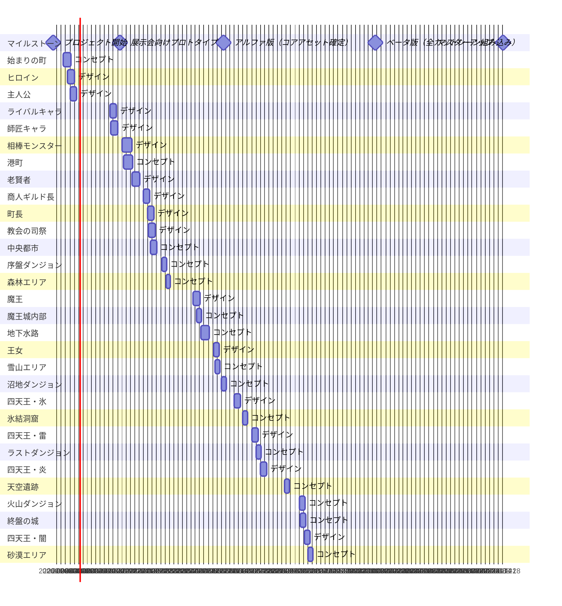

## プランナー

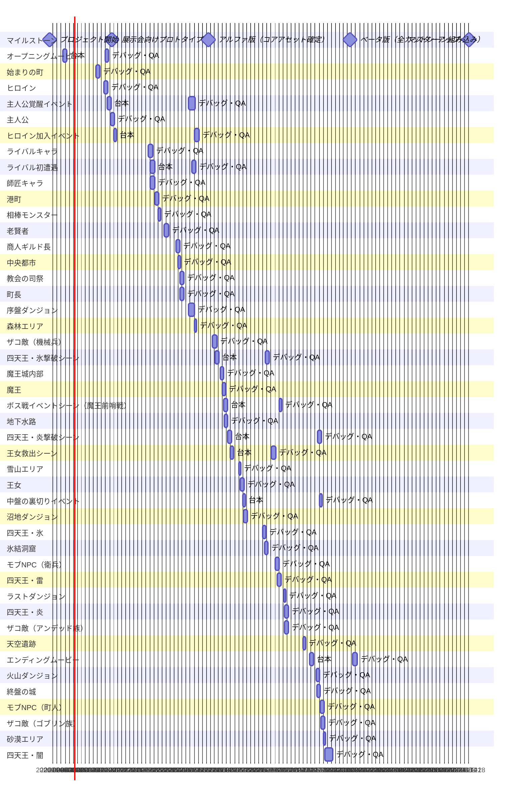

## 背景モデル

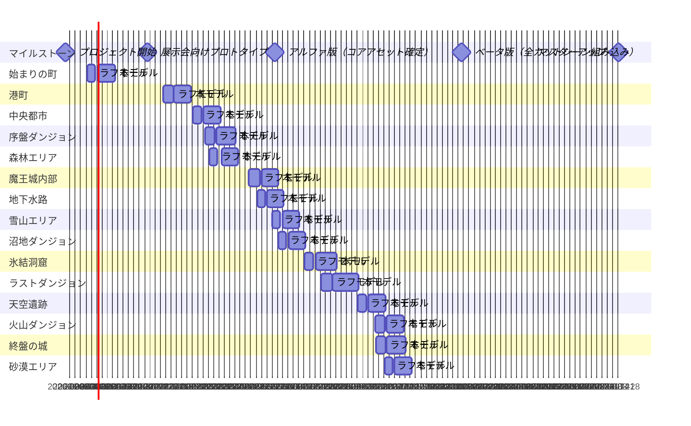

## カットシーン

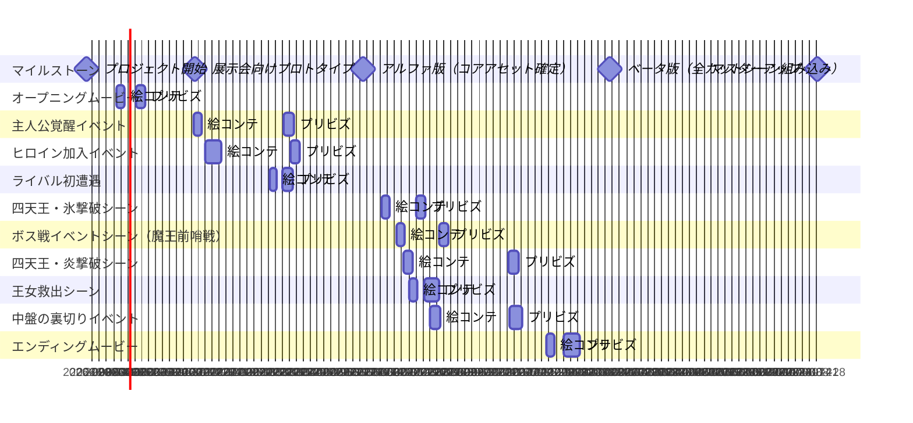

## キャラモデル

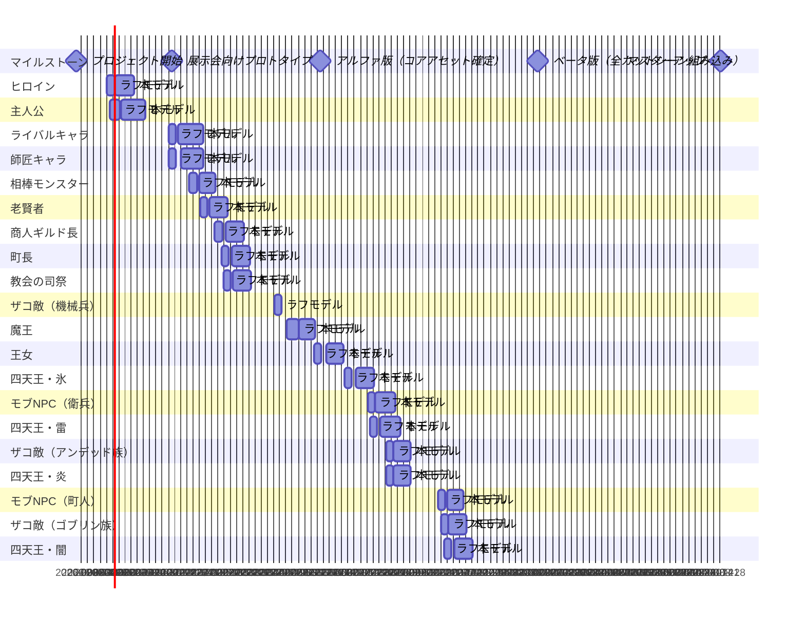

## モーション

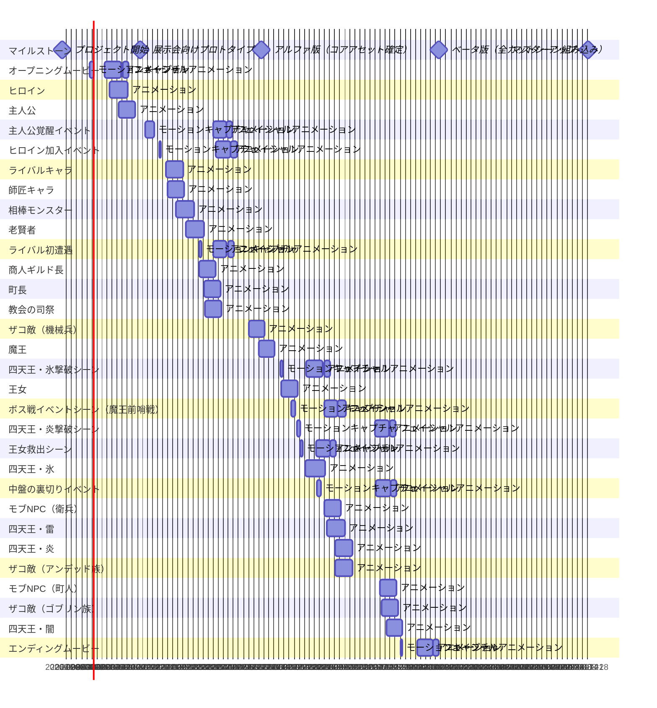

## TA

```mermaid
---
displayMode: compact
---
gantt
    dateFormat YYYY-MM-DD
    tickInterval 1week
    weekday monday

    section マイルストーン
    プロジェクト開始 :milestone, TEAM_MS_PROJECT_START, 2026-09-01, 0d
    展示会向けプロトタイプ :milestone, TEAM_MS_MS_PROTO, 2026-12-18, 0d
    アルファ版（コアアセット確定） :milestone, TEAM_MS_MS_ALPHA, 2027-06-04, 0d
    ベータ版（全カットシーン組み込み） :milestone, TEAM_MS_MS_BETA, 2028-02-04, 0d
    マスターアップ :milestone, TEAM_MS_MS_MASTER, 2028-08-29, 0d

    section ヒロイン
    リグ :TEAM_JOB_CHAR_HEROINE_CH_RIG, 2026-10-15, 2026-10-27
    フェイスリグ :TEAM_JOB_CHAR_HEROINE_CH_FACERIG, 2026-10-27, 2026-11-03
    エンジン実装 :TEAM_JOB_CHAR_HEROINE_CH_IMPL, 2026-12-01, 2026-12-04

    section 主人公
    リグ :TEAM_JOB_CHAR_HERO_CH_RIG, 2026-10-22, 2026-11-03
    フェイスリグ :TEAM_JOB_CHAR_HERO_CH_FACERIG, 2026-11-04, 2026-11-11
    エンジン実装 :TEAM_JOB_CHAR_HERO_CH_IMPL, 2026-12-11, 2026-12-16

    section 始まりの町
    最適化（LOD） :TEAM_JOB_BG_TOWN_BG_OPT, 2026-11-13, 2026-11-20

    section オープニングムービー
    エンジン実装 :TEAM_JOB_CS_OPENING_CS_IMPL, 2026-12-02, 2026-12-05

    section ライバルキャラ
    リグ :TEAM_JOB_CHAR_RIVAL_CH_RIG, 2026-12-25, 2027-01-14
    フェイスリグ :TEAM_JOB_CHAR_RIVAL_CH_FACERIG, 2027-01-14, 2027-01-21
    エンジン実装 :TEAM_JOB_CHAR_RIVAL_CH_IMPL, 2027-02-16, 2027-02-19

    section 師匠キャラ
    リグ :TEAM_JOB_CHAR_MENTOR_CH_RIG, 2026-12-28, 2027-01-15
    フェイスリグ :TEAM_JOB_CHAR_MENTOR_CH_FACERIG, 2027-01-15, 2027-01-22
    エンジン実装 :TEAM_JOB_CHAR_MENTOR_CH_IMPL, 2027-02-17, 2027-02-20

    section 相棒モンスター
    リグ :TEAM_JOB_CHAR_PARTNER_CH_RIG, 2027-01-18, 2027-01-28
    フェイスリグ :TEAM_JOB_CHAR_PARTNER_CH_FACERIG, 2027-01-28, 2027-02-04
    エンジン実装 :TEAM_JOB_CHAR_PARTNER_CH_IMPL, 2027-03-03, 2027-03-06

    section 老賢者
    リグ :TEAM_JOB_CHAR_SAGE_CH_RIG, 2027-01-29, 2027-02-10
    フェイスリグ :TEAM_JOB_CHAR_SAGE_CH_FACERIG, 2027-02-10, 2027-02-18
    エンジン実装 :TEAM_JOB_CHAR_SAGE_CH_IMPL, 2027-03-16, 2027-03-19

    section 商人ギルド長
    リグ :TEAM_JOB_CHAR_MERCHANT_CH_RIG, 2027-02-17, 2027-03-02
    フェイスリグ :TEAM_JOB_CHAR_MERCHANT_CH_FACERIG, 2027-03-02, 2027-03-09
    エンジン実装 :TEAM_JOB_CHAR_MERCHANT_CH_IMPL, 2027-04-05, 2027-04-08

    section 港町
    最適化（LOD） :TEAM_JOB_BG_PORT_BG_OPT, 2027-02-24, 2027-03-03

    section 町長
    リグ :TEAM_JOB_CHAR_MAYOR_CH_RIG, 2027-02-24, 2027-03-06
    フェイスリグ :TEAM_JOB_CHAR_MAYOR_CH_FACERIG, 2027-03-08, 2027-03-13
    エンジン実装 :TEAM_JOB_CHAR_MAYOR_CH_IMPL, 2027-04-12, 2027-04-15

    section 教会の司祭
    リグ :TEAM_JOB_CHAR_PRIEST_CH_RIG, 2027-02-25, 2027-03-09
    フェイスリグ :TEAM_JOB_CHAR_PRIEST_CH_FACERIG, 2027-03-09, 2027-03-16
    エンジン実装 :TEAM_JOB_CHAR_PRIEST_CH_IMPL, 2027-04-12, 2027-04-15

    section 中央都市
    最適化（LOD） :TEAM_JOB_BG_CAPITAL_BG_OPT, 2027-04-02, 2027-04-09

    section 序盤ダンジョン
    最適化（LOD） :TEAM_JOB_BG_DUNGEON_BG_OPT, 2027-04-21, 2027-04-28

    section ザコ敵（機械兵）
    本モデル :TEAM_JOB_CHAR_ENEMY_MACHINE_CH_MODEL, 2027-04-21, 2027-05-15
    リグ :TEAM_JOB_CHAR_ENEMY_MACHINE_CH_RIG, 2027-04-21, 2027-05-07
    エンジン実装 :TEAM_JOB_CHAR_ENEMY_MACHINE_CH_IMPL, 2027-06-08, 2027-06-11

    section 主人公覚醒イベント
    エンジン実装 :TEAM_JOB_CS_HERO_AWAKEN_CS_IMPL, 2027-04-26, 2027-04-29

    section ライバル初遭遇
    エンジン実装 :TEAM_JOB_CS_RIVAL_ENCOUNTER_CS_IMPL, 2027-04-27, 2027-05-01

    section 森林エリア
    最適化（LOD） :TEAM_JOB_BG_FOREST_BG_OPT, 2027-04-27, 2027-05-08

    section ヒロイン加入イベント
    エンジン実装 :TEAM_JOB_CS_HEROINE_JOIN_CS_IMPL, 2027-05-06, 2027-05-11

    section 魔王
    リグ :TEAM_JOB_CHAR_DEMONLORD_CH_RIG, 2027-05-11, 2027-05-21
    フェイスリグ :TEAM_JOB_CHAR_DEMONLORD_CH_FACERIG, 2027-05-21, 2027-05-28
    エンジン実装 :TEAM_JOB_CHAR_DEMONLORD_CH_IMPL, 2027-06-23, 2027-06-26

    section 王女
    リグ :TEAM_JOB_CHAR_PRINCESS_CH_RIG, 2027-06-10, 2027-06-22
    フェイスリグ :TEAM_JOB_CHAR_PRINCESS_CH_FACERIG, 2027-06-22, 2027-06-29
    エンジン実装 :TEAM_JOB_CHAR_PRINCESS_CH_IMPL, 2027-07-26, 2027-07-29

    section 魔王城内部
    最適化（LOD） :TEAM_JOB_BG_DEMONCASTLE_IN_BG_OPT, 2027-06-16, 2027-06-23

    section 地下水路
    最適化（LOD） :TEAM_JOB_BG_SEWER_BG_OPT, 2027-06-23, 2027-06-30

    section 四天王・氷
    リグ :TEAM_JOB_CHAR_FOUR_ICE_CH_RIG, 2027-07-14, 2027-07-27
    フェイスリグ :TEAM_JOB_CHAR_FOUR_ICE_CH_FACERIG, 2027-07-27, 2027-08-03
    エンジン実装 :TEAM_JOB_CHAR_FOUR_ICE_CH_IMPL, 2027-08-31, 2027-09-04

    section 雪山エリア
    最適化（LOD） :TEAM_JOB_BG_SNOW_BG_OPT, 2027-07-16, 2027-07-24

    section 沼地ダンジョン
    最適化（LOD） :TEAM_JOB_BG_SWAMP_BG_OPT, 2027-07-28, 2027-08-04

    section モブNPC（衛兵）
    リグ :TEAM_JOB_CHAR_NPC_GUARD_CH_RIG, 2027-08-05, 2027-08-20
    エンジン実装 :TEAM_JOB_CHAR_NPC_GUARD_CH_IMPL, 2027-09-22, 2027-09-28

    section 四天王・雷
    リグ :TEAM_JOB_CHAR_FOUR_THUNDER_CH_RIG, 2027-08-10, 2027-08-25
    フェイスリグ :TEAM_JOB_CHAR_FOUR_THUNDER_CH_FACERIG, 2027-08-25, 2027-09-01
    エンジン実装 :TEAM_JOB_CHAR_FOUR_THUNDER_CH_IMPL, 2027-09-28, 2027-10-01

    section ザコ敵（アンデッド族）
    リグ :TEAM_JOB_CHAR_ENEMY_UNDEAD_CH_RIG, 2027-08-25, 2027-09-07
    エンジン実装 :TEAM_JOB_CHAR_ENEMY_UNDEAD_CH_IMPL, 2027-10-08, 2027-10-14

    section 四天王・炎
    リグ :TEAM_JOB_CHAR_FOUR_FIRE_CH_RIG, 2027-08-25, 2027-09-07
    フェイスリグ :TEAM_JOB_CHAR_FOUR_FIRE_CH_FACERIG, 2027-09-07, 2027-09-14
    エンジン実装 :TEAM_JOB_CHAR_FOUR_FIRE_CH_IMPL, 2027-10-08, 2027-10-14

    section 氷結洞窟
    最適化（LOD） :TEAM_JOB_BG_ICECAVE_BG_OPT, 2027-09-02, 2027-09-09

    section 四天王・氷撃破シーン
    エンジン実装 :TEAM_JOB_CS_FOUR_ICE_DEFEAT_CS_IMPL, 2027-09-07, 2027-09-10

    section 王女救出シーン
    エンジン実装 :TEAM_JOB_CS_PRINCESS_RESCUE_CS_IMPL, 2027-09-15, 2027-09-18

    section ボス戦イベントシーン（魔王前哨戦）
    エンジン実装 :TEAM_JOB_CS_BOSS_CS_IMPL, 2027-09-29, 2027-10-02

    section ラストダンジョン
    最適化（LOD） :TEAM_JOB_BG_LASTDUNGEON_BG_OPT, 2027-10-04, 2027-10-09

    section モブNPC（町人）
    リグ :TEAM_JOB_CHAR_NPC_TOWN_CH_RIG, 2027-10-25, 2027-11-05
    エンジン実装 :TEAM_JOB_CHAR_NPC_TOWN_CH_IMPL, 2027-12-10, 2027-12-15

    section ザコ敵（ゴブリン族）
    リグ :TEAM_JOB_CHAR_ENEMY_GOBLIN_CH_RIG, 2027-10-26, 2027-11-06
    エンジン実装 :TEAM_JOB_CHAR_ENEMY_GOBLIN_CH_IMPL, 2027-12-13, 2027-12-16

    section 四天王・闇
    リグ :TEAM_JOB_CHAR_FOUR_DARK_CH_RIG, 2027-11-02, 2027-11-13
    フェイスリグ :TEAM_JOB_CHAR_FOUR_DARK_CH_FACERIG, 2027-11-15, 2027-11-20
    エンジン実装 :TEAM_JOB_CHAR_FOUR_DARK_CH_IMPL, 2027-12-20, 2027-12-23

    section 天空遺跡
    最適化（LOD） :TEAM_JOB_BG_RUINS_BG_OPT, 2027-11-08, 2027-11-13

    section 火山ダンジョン
    最適化（LOD） :TEAM_JOB_BG_VOLCANO_BG_OPT, 2027-12-01, 2027-12-08

    section 終盤の城
    最適化（LOD） :TEAM_JOB_BG_CASTLE_BG_OPT, 2027-12-02, 2027-12-09

    section 四天王・炎撃破シーン
    エンジン実装 :TEAM_JOB_CS_FOUR_FIRE_DEFEAT_CS_IMPL, 2027-12-07, 2027-12-10

    section 中盤の裏切りイベント
    エンジン実装 :TEAM_JOB_CS_BETRAYAL_CS_IMPL, 2027-12-08, 2027-12-11

    section 砂漠エリア
    最適化（LOD） :TEAM_JOB_BG_DESERT_BG_OPT, 2027-12-13, 2027-12-18

    section エンディングムービー
    エンジン実装 :TEAM_JOB_CS_ENDING_CS_IMPL, 2028-02-04, 2028-02-09

```

## エフェクト

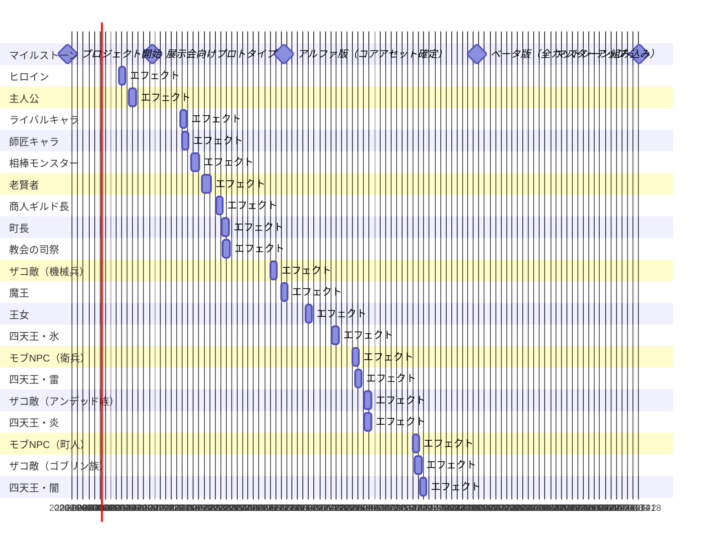

## ライティング

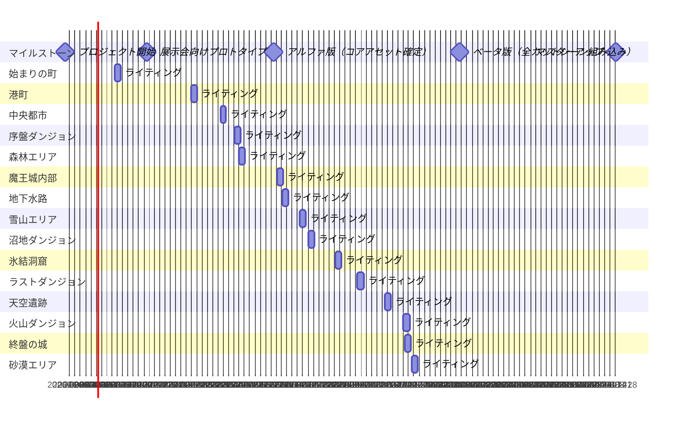
